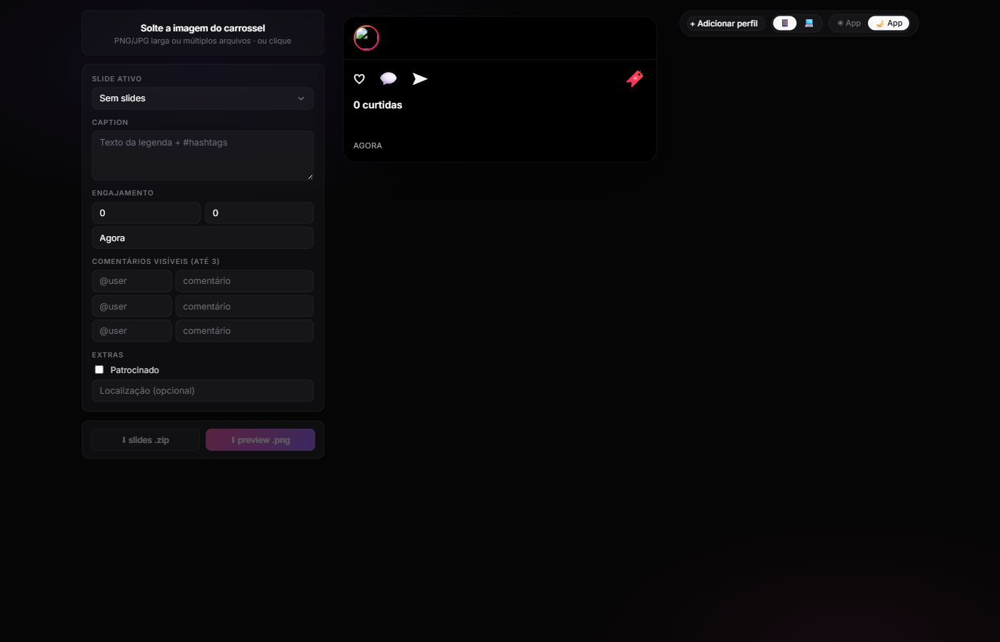

# Preview Carrossel

Pré-visualize como seu carrossel do Instagram vai aparecer no feed antes de postar: mockup no mobile e no desktop, tema claro/escuro e exportação dos slides já cortados.

Acesse: https://preview-carrossel.vercel.app



É um app web estático. Você joga a imagem (ou várias imagens) do carrossel, ele detecta sozinho quantos slides tem, mostra a prévia de como vai ficar o post (avatar, @, legenda, curtidas, comentários, tudo editável) e exporta os slides individuais prontos pra subir no feed.

Roda tudo no navegador. Sem login, sem backend, sem upload pra servidor, a imagem nunca sai do seu computador.

## O que dá pra fazer

**Detecção e corte automático.** Sobe uma imagem larga (tipo 4320x1350 do Photoshop) e ele detecta o formato sozinho:

- 1:1 quadrado (1080x1080)
- 4:5 retrato (1080x1350), o padrão do Instagram
- 9:16 story (1080x1920)

A detecção é ancorada pela altura, que costuma ser o sinal mais confiável do formato. Se errar, é só arrastar as linhas de corte ou usar os botões de + e - pra ajustar. Também aceita vários arquivos separados (slide-1.png, slide-2.png e por aí vai), aí ele pula a detecção e usa direto.

**Frame do Instagram.** Replica o post no mobile (vertical, feed) e no desktop (aquele modal de duas colunas), com tema claro e escuro (preto puro no dark, igual o app de verdade). O carrossel desliza mesmo: você arrasta com o dedo ou o mouse e a imagem acompanha, com um snap suave quando solta, resistência nas bordas e navegação pelo teclado.

**Tudo editável.** Avatar (faz upload da logo e ele redimensiona pra 200x200), @ do perfil com selo verificado opcional, legenda, número de curtidas (texto livre, tipo 1.234 ou 5 mil), quantidade de comentários, até 3 comentários visíveis, "há X horas", patrocinado e localização.

**Perfis salvos.** Dá pra guardar até 5 perfis (logo + @) no localStorage e trocar num clique. Útil pra quem cuida de várias marcas.

**Rascunhos.** Todo carrossel que você sobe vira um rascunho automático. Ele lista os 5 mais recentes com thumbnail e restaura num clique. Se o localStorage encher, descarta o mais antigo.

**Exportação.** Slides em ZIP (slide-1.png, slide-2.png e assim por diante, em resolução cheia) ou o preview inteiro em PNG 2x pra mandar pro cliente ou jogar numa apresentação.

## Stack

- Vite 5 e TypeScript no modo strict. Sem framework de UI, é vanilla JS reativo com um store próprio.
- Vitest com jsdom pros testes.
- Canvas API pro processamento de imagem (corte, resize, thumbnails).
- JSZip pra montar o ZIP dos slides.
- html-to-image pra capturar o preview em PNG.
- localStorage pra perfis, rascunhos e tema, com fallback pra quando estoura a quota.
- Deploy estático na Vercel.

O bundle final fica em torno de 136 KB (uns 44 KB gzipped).

## Rodando local

```bash
git clone https://github.com/gabimitd/preview-carrossel.git
cd preview-carrossel
npm install
npm run dev
```

Abre em http://localhost:5173.

Outros comandos:

```bash
npm test         # roda os testes
npm run build    # build de produção (gera a pasta dist/)
npm run preview  # serve o build pronto
```

## Deploy na Vercel

A Vercel reconhece o Vite sozinho. Dá pra usar a CLI:

```bash
npm i -g vercel
vercel --prod
```

Ou importar o repo na Vercel e aceitar os defaults (build com `npm run build`, output em `dist`). Aí cada push já dispara um deploy.

## Estrutura

```
src/
  main.ts             liga tudo no boot
  types.ts            AppState, Profile, Slide, PostContent, Draft
  state.ts            store reativo (subscribe, setState, update)
  app-store.ts        store tipado com persistência seletiva
  storage.ts          localStorage com fallback de quota
  validations.ts      sanitizeUsername, clamp, formatTimeAgo
  upload.ts           drag and drop e file input
  grid-detect.ts      detecção da grade pela altura
  splitter.ts         corte via Canvas
  grid-editor.ts      a tira com as linhas de corte que dá pra arrastar
  ig-frame.ts         o frame com swipe e animação
  ig-frame-mobile.ts  render do mobile
  ig-frame-desktop.ts render do desktop
  fields-form.ts      formulário dos campos
  profiles.ts         perfis salvos
  drafts.ts           autosave e restore
  drafts-menu.ts      UI dos rascunhos
  theme.ts            toggles de tema e device
  resize-image.ts     resize de avatar e thumbnails
  export-png.ts       captura do preview
  export-zip.ts       ZIP dos slides
  ui-layout.css       tokens, layout, cores
```

A ideia é store + listeners, sem framework. Cada módulo de UI faz `mountX(container, store)`, monta o DOM, se inscreve no store pra atualizar e devolve uma função de cleanup. A lógica pura (grid-detect, splitter, validations, state) é toda testável no jsdom. Só perfis, tema e rascunhos vão pro localStorage; o resto fica em memória.

## Testes

```bash
npm test
```

São 29 testes cobrindo o store, a persistência, as validações, a detecção de grade e o splitter.

## Ideias pra uma v2

- Suporte a Reels (9:16 com indicador de vídeo)
- Exportar o carrossel passando como GIF ou MP4
- Mais idiomas (hoje só tem pt-BR)
- Templates de comentário prontos
- Domínio próprio e branding

## Licença

MIT
